Comprehending CHI Cache Coherent Interconnects
Eugene Cohen

# Introduction
In computer architecture classes we are introduced to cache coherency protocols like MSI, MESI, and MOESI, as well as snooping and directory-based appraoches.  However, as we look at modern implementations of systems we see more complexity and different terminology.  Also, it can be difficult to map to commercial implementations as not all details are publically visible.  This project focuses on understanding CHI, a modern cache coherent interconnect protocol and how it is used on advanced interconnect topologies.  One of the best ways to learn is to run real programs on real systems (or simulations of real systems) so in this project we execute workloads on the gem5 simulator modeling a mesh-topology interconnect that uses the CHI protocol.

The AMBA CHI Architecture Specification defines the protocol for a cache-coherent interconnect used on most ARM and many RISC-V systems. It defines a packet-based network-on-chip protocol that is used for a wide range of topologies from local subsystem interconnects to complex multi-die and multi-socket designs. The CHI interconnect relies on separate channels for requests, responses, snoops, and data transfer enabling a high degree concurrency and asynchronicity in its operations. The CHI protocol enables MESI and MOESI style coherency protocols but does so using more concise (and complex) state definitions.

The gem5 simulator enables architecture exploration by simulating different processor architectures and implementations, different cache and memories hierarchies, and different interconenct and coherency protocols with the goal of analyzing performance and correctness.  The gem5 simulator supports of an entire operating system stack (Full System Emulation - FS) or execution of standalone userspace programs (System Call Emulation - SE).  Included amongst the various topologies and coherency protocols already provided in gem5 is support for the CHI protocol.  Example system configurations for CHI are available including a simple crossbar interconnect with one directory/system-level cache as well as a more advanced 2x4 mesh topology with multiple requester, home, and subordinate nodes.

This project examines the CHI specification, following the evolution of AMBA interconnects over time, maps these concepts onto some representative commercial interconnect IPs and then seeks to reinforce these concepts by simulating programs in gem5 on a CHI mesh interconnect.  We employ a workload designed to induce coherency traffic and examine how varying workload parameters impacts system performance.

# AMBA Coherent Hub Interconnect

## Specifications

| Title | Spec | Year | Key Features |
| ----- | ---- | ---- | ------------ |
| APB | Advanced Peripheral Bus | 1997 |
| AHB | Advanced High Performance Bus | 1997| | Multiple masters, larger bus widths
| AXI3  | Advanced eXtensible Interface | 2003 | Higher perf, higher clock freq
| ACE  | AXI Coherency Extensions | 2010 | Additional signaling for system-wide coherency
| CHI  | Coherent Hub Interconnect | 2014 | Redesigned transport layer for higher performance


## APB - Advanced Peripheral Bus 

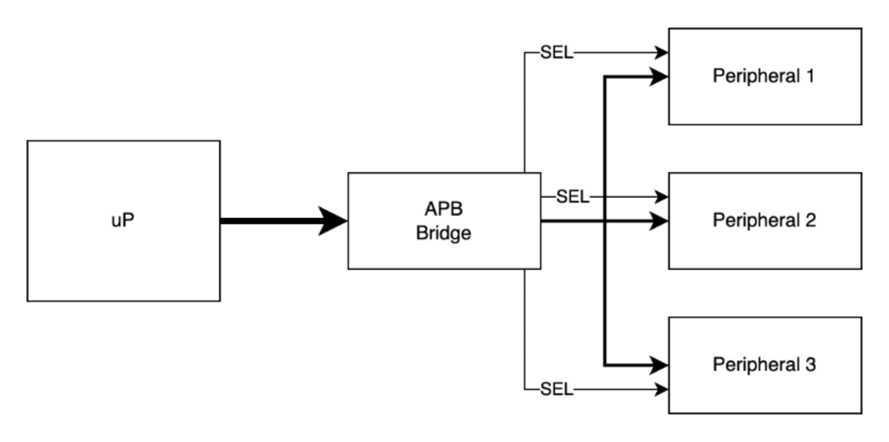

* One requester, N responders
* One shared bus for address, read+write data, response
* Decoder in bridge selects peripheral
* No:
  * Bursting
  * Exclusives
  * Overlapping transactions
  * Coherency


## AHB - Advanced High Performance Bus 

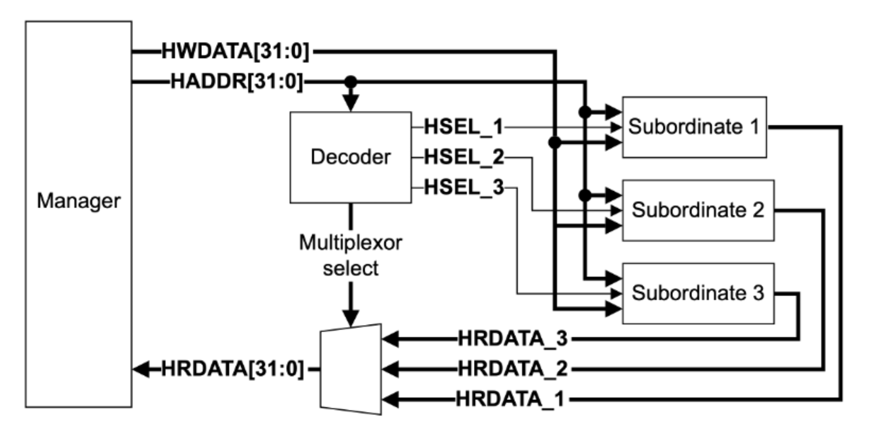
(Diagram from AMBA AHB Protocol Specification)

* Multiple requestors, multiple responders
  * although arbitration is not defined in AHB spec
* Burst transfers
* Exclusive transfers
* Shared bus or Crossbar
* No:
  * Overlapping transactions
  * Coherency


## AXI - Advanced eXtensible Interface

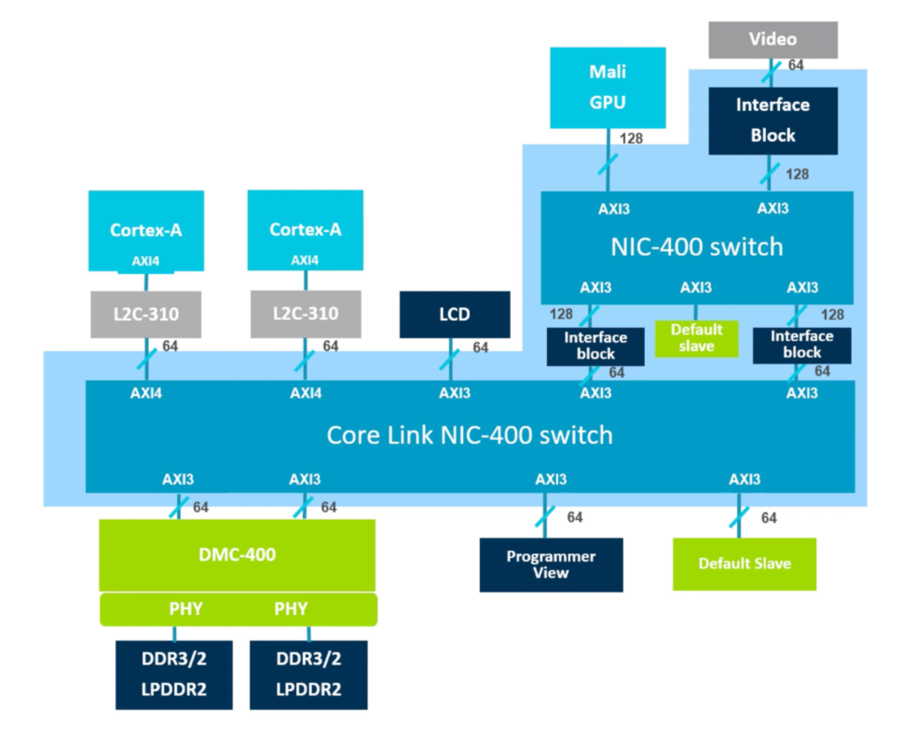
(Diagram from: What is AMBA?, https://www.youtube.com/watch?v=CZlDTQzOfq4)

* Separate read and write channels
* Multiple outstanding transactions
* Out-of-order completions
* Decoupled address and data
* Burst transactions
* Exclusive transactions
* Quality-of-service identifiers

### AXI Channel Architecture

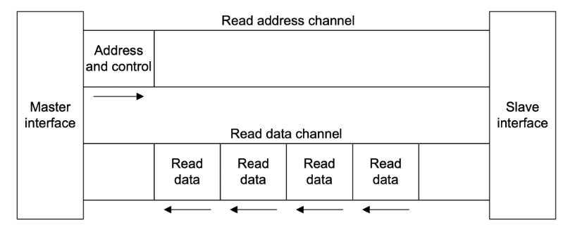
(Diagram from AMBA AXI and ACE Protocol Specification)

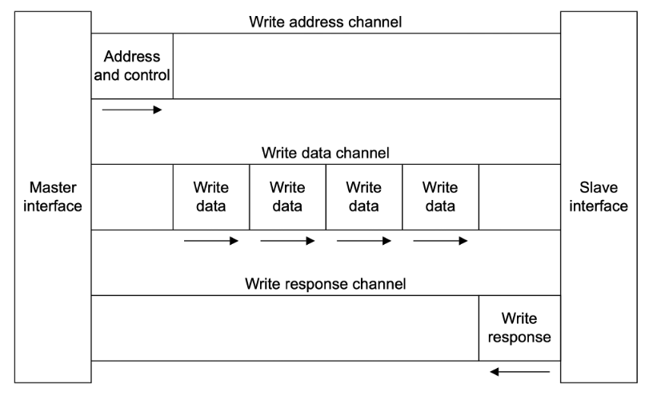
(Diagram from AMBA AXI and ACE Protocol Specification)

#### AXI4 Attributes

**AxCACHE**
* Non-Cacheable
  * Device
    * No merging+prefetching, no early ack
  * Normal Non-bufferable
    * Merging+prefetching OK, no early ack
  * Normal Bufferable
    * Merging+prefetching OK, early ack OK
* Cacheable
  * Write-Through / Write-Back
  * No-Allocate / Read-Allocate / Write-Allocate

**AxPROT**
* Privileged or Unprivileged
* Secure or Non-Secure
  * Used for TrustZone
* Instruction or Data


## ACE - AXI Coherency Extensions


(from ARM CoreLink CCI-400 TRM)

* Fully cache-coherent 
* Adds snoop channels
* Distributed Virtual Memory
* Barriers
* ACE-Lite: one-way coherency
  * can snoop but cannot be snooped


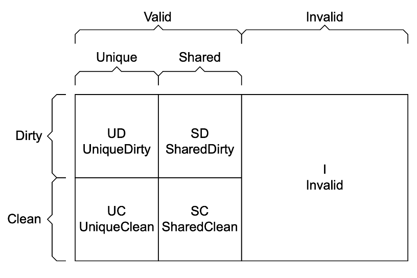
(Diagram from AMBA AXI and ACE Protocol Specification)

---
* Invalid: Cache line not present in cache
---
* Unique: Cache line only exists in one cache
* Shared: Cache line might exist in more than one cache
---
* Clean: This cache not responsible for updating main memory
* Dirty: This cache is responsible for updating main memory
---

semantics similar to MOESI

### ACE Transactions from Processor to Interconnect (Read/Write Requests)

| Transaction | Meaning | Typical Use |
| --- | --- | --- |
| ReadNoSnoop | Read, with no snooping/coherency with other nodes | Non-coherent memory or mmio access |
| WriteNoSnoop | Write, with no snooping/coherency with other nodes | Non-coherent memory or mmio access |
| ReadOnce | Read, initiator will not cache, ends in invalid state | Snapshot of data, non-temporal/non-spatial |
| ReadClean | Read, initiator ends in clean state | Write-through cache |
| WriteClean | Write, initiator ends in clean state | Speculative writeback |
| ReadNotSharedDirty | Read, unique-dirty OK, but shared-dirty not OK | Data load or instruction fetch |
| ReadShared | Read, all states OK | Data load or instruction fetch |
| ReadUnique | Read, initiator ends in unique-clean/dirty state | Prep for partial cache line store, initiator doesn’t have cache line |
| WriteUnique | Write, initiator ends in shared-clean state | Initiator without cache (e.g. IO) writing |
| CleanUnique | Clean other caches, initiator ends in unique state | Prep for partial cache line store, initiator already has cache line |
| CleanShared | Clean all caches | Explicit cache maintenance instructions in program |
| CleanInvalid | Clean and invalidate all caches | Snoop filter back-invalidation |
| MakeUnique | Remove other copies, initiator ends in unique-dirty | Data store miss of full cache line |
| MakeInvalid | Invalidate all caches | Explicit cache maintenance instructions in program |
| Evict | Indicates cache line has been evicted | No data transfer, only provides visibility to a snoop filter |
| WriteEvict | Write clean cache line to lower cache level | Eviction of clean cache line down the hierarchy |


### ACE Transactions from Interconnect to Processor (Snoop Requests)
| Transaction | Meaning | Typical Use |
| --- | --- | --- |
| ReadOnce | Snoop read, initiator will not cache | Enable the snooped processor to retain cacheline in unique state |
| ReadClean | Snoop read | Initiator has a write-through cache |
| ReadShared | Snoop read, snooped to shared-dirty or shared-clean | Initiator data load or instruction fetch |
| ReadNotSharedDirty | Snoop read, snooped to shared-dirty or invalid | Initiator data load or instruction fetch |
| ReadUnique | Snoop read, snooped must end in invalid state | Prep for partial cache line store, initiator doesn’t have cache line |
| CleanInvalid | Clean and invalidate all caches | Explicit cache maintenance instructions in program |
| MakeInvalid | Invalidate all caches | Explicit cache maintenance instructions in program |
| CleanShared | Clean all caches | Explicit cache maintenance instructions in program |


### ACE Coherency Responses

**PassDirty**
The node receiving this response gains responsibility for writing back the modified cacheline
If set, resulting state will be UniqueDirty or SharedDirty

**IsShared**
Indicates the returned data may be held in another cache
If set, resulting state will be SharedClean or SharedDirty

### ACE Snoop Filter


(from ARM CoreLink CCI-5500 TRM)

* Reduce coherency broadcasts 
* Track tags from upstream caches
  * A cache of tags without data
  * If capacity exceeded, perform a back-invalidation in upstream caches
* Only issue snoop transactions in case of a filter hit
* Requires additional ACE coherency messaging to maintain filter state
  * like Evict to inform filter when lines are invalidated due to capacity


## CHI
### CHI Channel Architecture
### CHI Transaction Types
#### CHI Requests
#### CHI Responses

### CHI Coherent Flows

Address X is in caches of both processors A and B in SharedClean state
  * Processor A: SharedClean
  * Processor B: SharedClean

Processor B wants to write address X so it prepares by sending a MakeUnique to Processor A
  * Processor A: Invalid
  * Processor B: UniqueClean

Processor B performs the write to its cache
  * Processor A: Invalid
  * Processor B: UniqueDirty


Address X is in dirty and only in Processor B’s cache
  * Processor A: Invalid
  * Processor B: UniqueDirty

Processor A wants to read address X so it sends a ReadShared
Processor B has a choice about who is responsible for eventually writing back data

Option 1 – B retains writeback responsibility:
  * Processor A: SharedClean
  * Processor B: SharedDirty
  
Option 2 – B relinquishes writeback responsibility:
  * Processor A: SharedDirty
  * Processor B: SharedClean

Option 3 – B evicts the cacheline:
  * Processor A: UniqueDirty
  * Processor B: Invalid


# Analyzing CHI Coherency Performance with gem5

## Environment

A build environment was created on an Ubuntu 24.04 host using a docker container for building and executing gem5.  The gem5 git repo (tag v24.1.0.2) was cloned.  Since gem5 already provides a Dockerfile no special detective work was required to find dependencies.

## Configuring gem5

Two different emulation modes are provided with gem5.  The Full System emulation (FS) will emulate an entire machine from its reset vector enabling execution of boot firmware (like ARM TF-A or RISC-V OpenSBI) and then booting into a full OS.  This capability is important for projects that require OS interaction or modifications like memory management, scheduler work and any specialized driver or HAL/BSP type of work.

For the CHI coherency project we started exporting FS mode and it was observed that a single Ubuntu boot takes multiple hours to complete (RV64 with a simple timing cpu model).  A rough comparison of performance is that about 3 seconds of OS boot execution corresponded to over an hour of simulation.  For Linux, it is possible to bypass the initialization of the OS distro and boot from a kernel and then set init to run /bin/bash but cycle times are still very slow compared to SE mode (below).  Given this performance would hamper any meaningful development we explored other modes of development.

The other mode of operation supported by gem5 is Syscall Emulation (SE).  In this mode user-space applications are executed and any time a call is made to an OS kernel the call is intercepted by gem5 and handled natively on the host.  This has the benefit of a major performance improvement over FS because with SE you can skip the OS boot process and begin executing the first program opcodes within a few seconds.  A downside of SE is that it does not match the OS behaviors for interacting with hardware which for an architectural simulator can be important when it comes to things like utilization of caches, TLBs and memory.  The Syscall Emulation mode also requires that syscalls that appear in programs are well-supported in gem5.  If a new syscall is added to, say, the Linux ABI then gem5 will need to be updated to faithfully handle (or sometimes ignore) the syscall so the program can function.

### Syscall Emulation Pitfalls

We began exploring SE mode for emulating the Linux kernel ABI and needed to confirm that SE would be capable of handling multiprocessing in one program - sending threads to other cores so we can see the appropriate interconnect and coherency effects.  Fortunately the gem5 source tree includes a basic multiprocesing test called 'threads' which distributes a matrix multiplication across all detected CPU cores.  It turns out that running this simple threads test exposed a deficiency in the capability of SE mode on some architectures.

Initially the intent was to use the ARM processor architecdture for the CHI coherency work because it seemed like the most natural fit - the AMBA CHI specfication originates from ARM, ARM products have the longest history with CHI, and the gem5 build for ARM selects CHI as it's default coherency protocol.  So with an ARM variant of gem5 built, we tried to execute the 'threads' program in SE mode and it immediately failed.

```fatal: Syscall 435 out of range```

We inspected the syscalls supported in the gem5 source.  The syscall support is both OS- and architecture-specific.  For our ARM Linux case, we examined `src/arch/arm/linux/se_workload.cc`.

So for our failing syscall 435 we can examined the syscall emulation table for 64-bit ARM linux:

```
class SyscallTable64 : public SyscallDescTable<EmuLinux::SyscallABI64>
...
        {  base + 292, "io_pgetevents"},
        {  base + 293, "rseq", ignoreWarnOnceFunc },
        {  base + 294, "kexec_file_load"},
        { base + 1024, "open", openFunc<ArmLinux64> },
        { base + 1025, "link" },
        { base + 1026, "unlink", unlinkFunc },
        { base + 1027, "mknod", mknodFunc },
```

and as we see there's a gap that skips over 435.

How do we know what 435 means?  We could just look at glibc or linux kernel source code or through searching we can find a [quick reference](https://www.chromium.org/chromium-os/developer-library/reference/linux-constants/syscalls/#aarch64_435) from the chromium project (chromium runs on the linux kernel, so that's ok).  From this reference we see this is the clone3 syscall.  This is a series of syscalls that implements fork-like functionality as we can see from the [clone3 man page](https://man.archlinux.org/man/clone3.2.en).

How is it that a test included in gem5 fails on an architeture supported in gem5 SE?  This is likely due to the fact that the C library (glibc/libstdc++) was updated at some point to change the underlying implementation for creating new threads.  The threads program does not call fork or clone directly, it uses the C++ standard threading library (std::thread) which, in turn selects the underlying syscall.  So simply by changing compilers we can select newer version of libraries that can make syscalls in a new way.  This means gem5 maintainers have a difficult job as they need to chase updates in libraries as they are made (or in our case, not).

Interestingly, for the clone3 syscall there is support present in gem5 for *other* architecdtures, specifically X86 and RISC-V::

```
src/arch/x86/linux/syscall_tbl64.cc:    { 435, "clone3", clone3Func<X86Linux64> },
src/arch/riscv/linux/se_workload.cc:    { 435,  "clone3", clone3Func<RiscvLinux64> },
src/sim/syscall_emul.hh:clone3Func(SyscallDesc *desc, ThreadContext *tc,
```

So as an experiment we ported this support from RISC-V to ARM and were able to successfully execute the threads program.

This led to the broader question - what other syscalls might we be missing?  Since we are building a plain linux executable, we can run it on a different machine and use strace under linux (the full OS this time) to trace syscall usage.  On an arm64 host/vm/qemu we launch the command under strace thusly:

```strace -n -o strace.txt ./threads```

and thanks to the -n switch we can see the syscalls including syscall number:

```
[ 134] rt_sigaction(SIGRT_1, {sa_handler=0xfd15ae0c2840, sa_mask=[], sa_flags=SA_ONSTACK|SA_RESTART|SA_SIGINFO}, NULL, 8) = 0
[ 135] rt_sigprocmask(SIG_UNBLOCK, [RTMIN RT_1], NULL, 8) = 0
[ 222] mmap(NULL, 8454144, PROT_NONE, MAP_PRIVATE|MAP_ANONYMOUS|MAP_STACK, -1, 0) = 0xfd15ad600000
[ 226] mprotect(0xfd15ad610000, 8388608, PROT_READ|PROT_WRITE) = 0
[ 135] rt_sigprocmask(SIG_BLOCK, ~[], [], 8) = 0
[ 435] clone3({flags=CLONE_VM|CLONE_FS|CLONE_FILES|CLONE_SIGHAND|CLONE_THREAD|CLONE_SYSVSEM|CLONE_SETTLS|CLONE_PARENT_SETTID|CLONE_CHILD_CLEARTID, child_tid=0xfd15ade0f230, parent_tid=0xfd15ade0f230, exit_signal=0, stack=0xfd15ad600000, stack_size=0x80ea20, tls=0xfd15ade0f8a0} => {parent_tid=[36110]}, 88) = 36110
[ 135] rt_sigprocmask(SIG_SETMASK, [], NULL, 8) = 0
[ 222] mmap(NULL, 8454144, PROT_NONE, MAP_PRIVATE|MAP_ANONYMOUS|MAP_STACK, -1, 0) = 0xfd15acc00000
[ 226] mprotect(0xfd15acc10000, 8388608, PROT_READ|PROT_WRITE) = 0
[ 135] rt_sigprocmask(SIG_BLOCK, ~[], [], 8) = 0
```

and cross-reference this to gem5's syscall emulation table

However this broken-syscall experience served as a warning, that the ARM architecture is not being maintained quite as well in 2025 as X86 and RISC-V.  Since it is possible for CHI to be used with other architectures we switched from ARM to RISC-V at this point.


### Build gem5 for RISC-V with CHI Coherency

 The default coherency protocol for gem5 for RISC-V is not CHI so we needed a way to get RISC-V and CHI working together.  Although most aspects of the system construction can be changed when starting gem5 without rebuilding it, switching to a different coherency protocol requires a specialized build configuration for gem5.  We had to create a new gem5 configuration file, placed at build_opts/RISCV_CHI which specifies that we want RISCV but also to use RUBY and the CHI coherency protocol:

```
RUBY=y
PROTOCOL="CHI"
RUBY_PROTOCOL_CHI=y
BUILD_ISA=y
USE_RISCV_ISA=y
```

We then built this RISCV_CHI variant and used it for the project.


## CHI Topology

With the project focused on understanding CHI coherency we expolored the interconnect topology options already present in gem5.  For CHI, the following configurations are supported:
* Crossbar
* Pt2Pt
* CustomMesh

### Pt2Pt

The point-to-point is a single interconenct with direct connectivity between all nodes.  The  concept implies that requests can traverse the interconnect without having to wait for transaction buffer resources and without incurring additional hops along the way.  

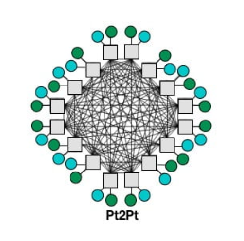

### Crossbar

Practically speaking an everything-to-everything topology is not realistic.  A common approach for small interconencts is a crossbar where the interconnect contains a crossbar switch allowing simulatneous streams of communication between separate initiators and targets.  The crossbar switch is itself a contstrained resource because it is limited by internal connectivity and internal queues/FIFOs resources.

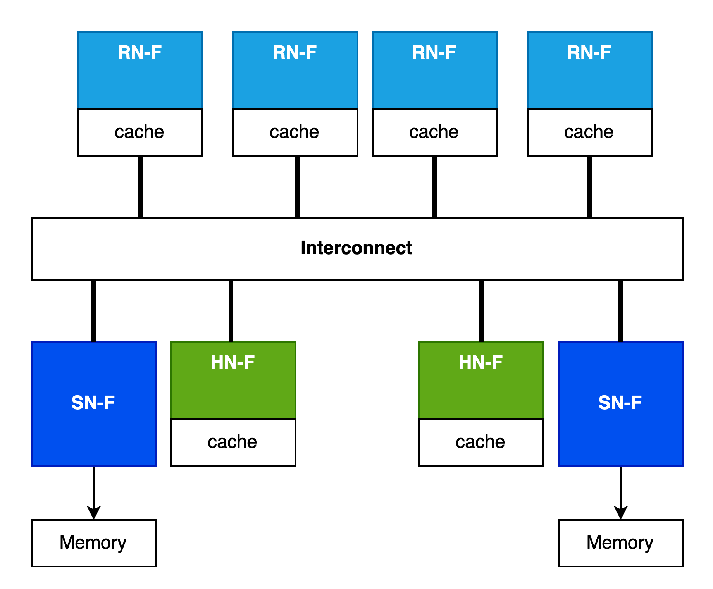

For small/local interconnects the crossbar is a reasonable solution but for larger systems a is not practical and the crossbar switch cannot scale to larger numbers of initiators and targets in the system, both logically and physically.  If we think of a 128-core server SOC with dozens of PCIe and memory controllers we can see that something different is needed.


### Mesh
CustomMesh means that the topology is loaded from a file describing the interconnect configuration.

gem5 includes an example 2x4 custom mesh topology file (2x4.py) which defines the locations of node types in the mesh pattern, primarily RNFs for processors, HNFs for directories and system-level caches (SLCs) and main memory SNFs for memory controllers.

Mesh dimensions are defined as rows and columns:
```
class NoC_Params(CHI_config.NoC_Params):
    num_rows = 2
    num_cols = 4
```

and which then implies mesh position numbers:
```
 0 --- 1 --- 2 --- 3
 |     |     |     |
 4 --- 5 --- 6 --- 7
```
from here nodes are mapped onto the mesh, for example RNFs (processors) are mapped to the inside positions:
```
class CHI_RNF(CHI_config.CHI_RNF):
    class NoC_Params(CHI_config.CHI_RNF.NoC_Params):
        router_list = [1, 2, 5, 6]
```
along with HNFs:
```
class CHI_HNF(CHI_config.CHI_HNF):
    class NoC_Params(CHI_config.CHI_HNF.NoC_Params):
        router_list = [1, 2, 5, 6]
```
and curiously the default main memory SNFs allocated on the left-hand side:
```
class CHI_SNF_MainMem(CHI_config.CHI_SNF_MainMem):
    class NoC_Params(CHI_config.CHI_SNF_MainMem.NoC_Params):
        router_list = [0, 4]
```
so there is some imbalance here as RNFs towards the left (positions 1 and 5) will have lower latency memory access compared to the RNFs towards the right (positions 2 and 6).

So combining all the information from the 2x4 NOC config we can visualize the topology with nodes placed:

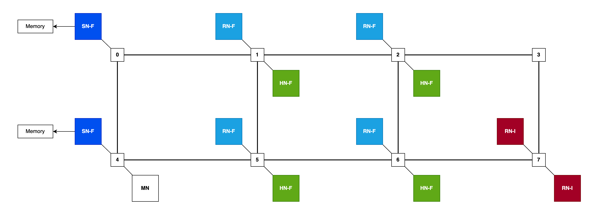


## Mapping gem5 Resources to CHI Topology

When we invoke gem5 via the Syscall Emulation wrapper script, se.py we pass parameters and these get mapped by the CHI configuration logic into a specfiic topology.    In some cases there may not always be a perfect match between the resources specified on invocation and the topology described for the interconnect so the mapping process will fill available slots, like mapping gem5 CPU instances to CHI RN-f nodes.


| Option         | Example              | Meaning                                                  |
| -------------- | -------------------- | -------------------------------------------------------- |
| --cpu-type     | RiscvTimingSimpleCPU | type of CPU to model - simple, in-order, out-of-order    |
| --topology     | CustomMesh           | interconnect topology to use                             |
| --chi-config   | 2x4.py               | topology configuraiton specifying location of node types |
| --num-cpus     | 4                    | Number of CPUs, maps to CHI RN-Fs                        |
| --num-dirs     | 2                    | Number of coherency directories, maps to CHI HN-Fs       |
| --num-l3caches | 2                    | Number of system-level caches, maps to CHI HN-Fs         |


One thing that is not possible with the mapping system is being able to specify different latencies for different links.  We hoped that we could model some links as having higher latency to simulate a multi-die or multi-socket NUMA scenario.  This limitation is not inherent in gem5 or even in CHI support, it's only a limitation of the convenient mapping system provided.   It would be possible to more directly specify the configuration through customizing configuration scripts.


## Multi-Threaded Execution in gem5 Syscall Emulation

There is a multi-threaded test in the gem5 source tree already at tests/test-progs/threads/src/threads.cpp .  This uses C++ standard threading (std::thread).

### Building Thread Test
By default this is only built for x86 but the makefile at tests/test-progs/threads/src/Makefile can be adjusted to add other architectures:

```
../bin/x86/linux/threads: threads.cpp
	g++ -o ../bin/x86/linux/threads threads.cpp -pthread -std=c++11

../bin/arm/linux/threads: threads.cpp
	aarch64-linux-gnu-g++ -static -o ../bin/arm/linux/threads threads.cpp -pthread -std=c++11

../bin/riscv/linux/threads: threads.cpp
	riscv64-linux-gnu-g++ -static -o ../bin/riscv/linux/threads threads.cpp -pthread -std=c++11
```

Note the -static switch - without this a dynamic library will be built and if you are running cross-architecture some difficult dynamic library path fixups will be required.

#### Note about Syscall Emulation on ARM

The ARM SE support has fallen behind both X86 and RISC-V.  For example the clone3 syscall is not supported on ARM even though it is on X86 and RISC-V.  This seems to indicate that gem5 ARM support is not getting the same level of attention as other architectures.

Even porting clone3 syscall support to ARM there are other defects like handling of special files such as handling of special filesystem devices like `/sys/devices/system/cpu/online` which is used by std::threading to detect number of cores.

Because ARM syscall emulation has fallen behind we choose to focus on RISC-V which is better suproted in gem5.


#### Note About Deprecation Warnings for se.py 

Note: The gem5 scripts will warn that se.py is deprecated.  However for many configurations there are no alternatives in-tree that don't use se.py, specifically the CHI.py module which requires the command-line options and system construction from se.py.  If you try to avoid this you end up going on a wild goose chase and end up back to realizing that se.py is the only way to go until the in-tree configurations are rewritten.


## Thrasher Test Program

In order to ensure that interesting coherency traffic occurs we need a multi-processor environment where cores share data in the same cachelines.  We created a multi-threaded test case that is designed to generate coherency traffic by inducing false-sharing.

Using the C++ std::threading interface we created a test program that allocates a thread for each CPU where each thread repeatedly increments a 32-bit value in memory.  A parameter is defined to control the placement of this data to either induce or avoid false-sharing.

If we pack the values being incremented by CPUs together they will access the same cacheline to perform their read-modify-write to increment the value.  The memory layout and CPU accesses are depicted thusly:

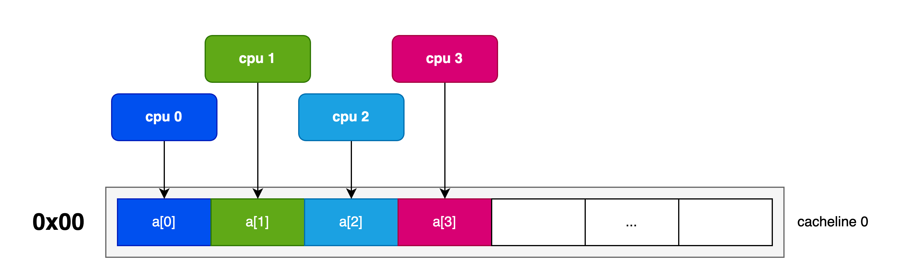

By increasing the stride of allocations we can ensure that the data is located far enough away to reside on different cachelines:

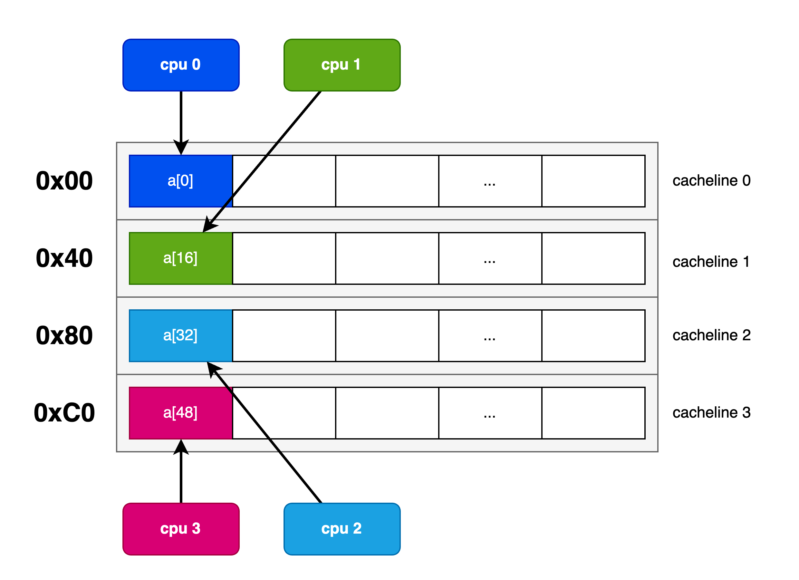

### Invocation

The program accepts one argument which is the stride in memory for the respective 32-bit values.  A stride of 1 will pack the values together so that values shared by different CPUs will occupy one 64-byte cacheline.  (We can fit up to 16 CPUs worth of uint32/4-byte data in one 64-byte cacheline).

Alternatively, we can increase this stride to ensure that each CPU will access its own dedicated cacheline.  A stride value of 16 will pad the values to ensure that each 4B value will be spaced out 64B apart eliminating false sharing on the 64B-sized-cacheline architecture.  To verify proper placement, we print the address of each data element at the start of the test.

Here's a 4-core packed configuration with a stride of 1 to induce false sharing:
```
Running on 4 cores. with 10000 values and data stride of 1 uint32_t values
a[i] at address 0x 23c220
a[i] at address 0x 23c224
a[i] at address 0x 23c228
a[i] at address 0x 23c22c
```

And here's the padded config with a stride of 16 to avoid false sharing:
```
Running on 4 cores. with 10000 values and data stride of 16 uint32_t values
a[i] at address 0x 23c220
a[i] at address 0x 23c260
a[i] at address 0x 23c2a0
a[i] at address 0x 23c2e0
```

### Test Cases

#### Configuration

We execute using gem5 Syscall Emulation (SE) using the CHI 2x4 mesh using 2 HN-Fs with caches.  Each CPU is a RiscvTimingSimpleCPU and each have their own L1 Data, L1 Instruction and Unified L2 caches.

TODO: get cache sizes
TODO: get model latencies and clock rates

#### Permutations

We define 8 test permutations, varying the number number of processors, and across either packed (stride 1) or padded (stride 16) configurations.

|   Case      | Cores | Stride |
| ----------- | ----- | ------ |
| 1c-stride1  |   1   |   1    |
| 2c-stride1  |   2   |   1    |
| 4c-stride1  |   4   |   1    |
| 8c-stride1  |   8   |   1    |
| 1c-stride16 |   1   |   16   |
| 2c-stride16 |   2   |   16   |
| 4c-stride16 |   4   |   16   |
| 8c-stride16 |   8   |   16   |


### Data Collected

To analyze the effect of coherency on CPU performance we collect CPU cycles and cycles per instruction (CPI) as we expect the CPU performance to reduce (more cycles, higher CPI) as coherency traffic increases.

We also capture counters for CHI coherency traffic at the HN-Fs, snoops to L2 cache and snoops to L1 d-cache.

|    Stat      | Reason                                                           |
| ------------ | ---------------------------------------------------------------- |
| Cycles       | Compare processor performance reduction due to coherency traffic |
| CPI          | Compare processor performance reduction due to coherency traffic |
| L1/L2 Snoops | Compare amount of coherency traffic across different strides     |
| HNF Snoops   | Examine coherency traffic as well as HN-F SAM effects            |


## Test Results

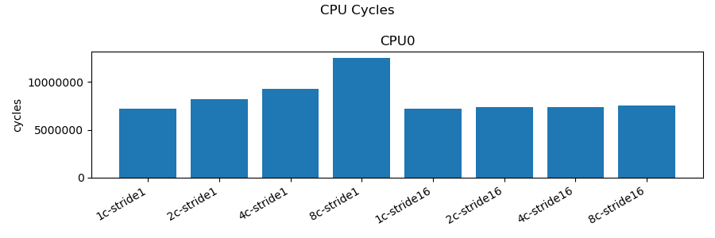

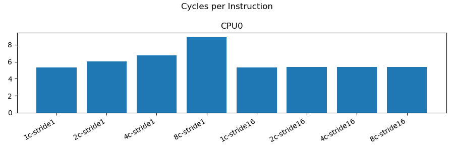

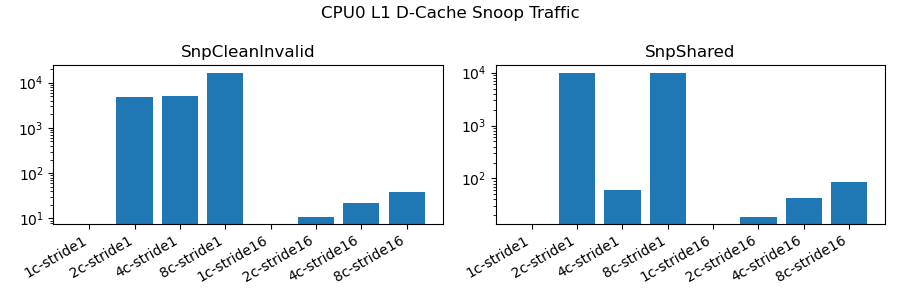

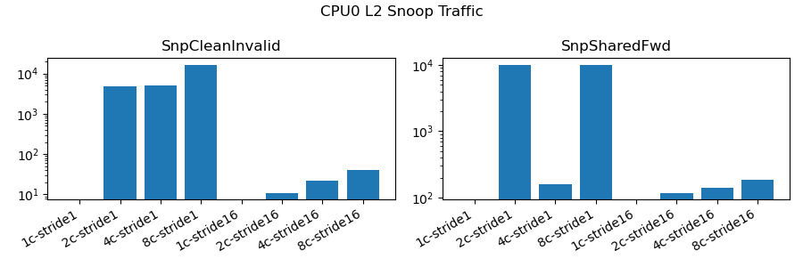

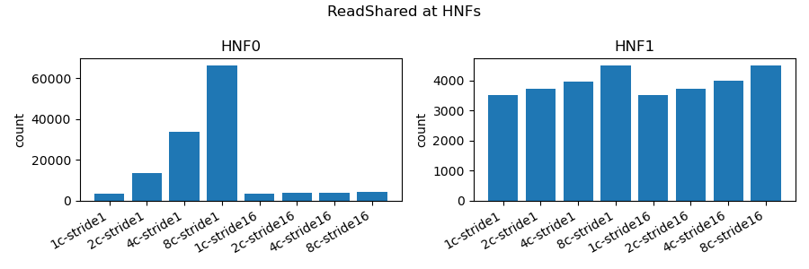

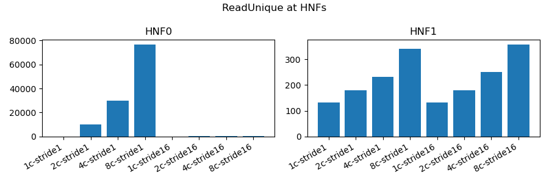

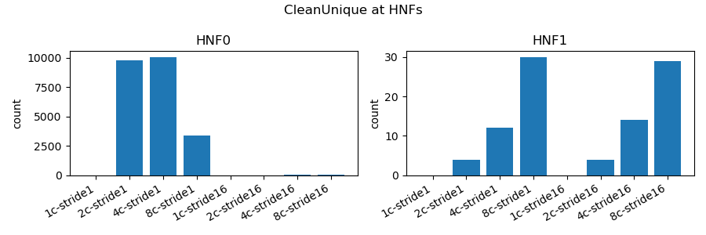

TODO writeup

# Conclusion

TODO Able to understand CHI, simulate CHI interconnects and examine coherency effects as well as mitigation through data placement
